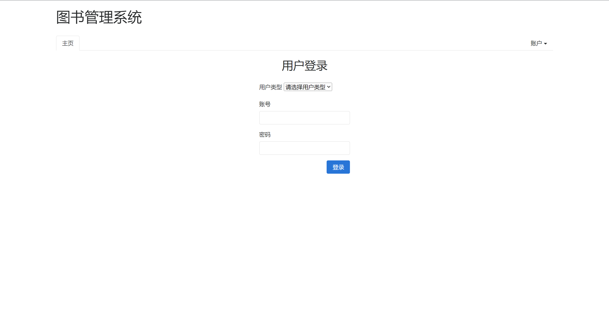
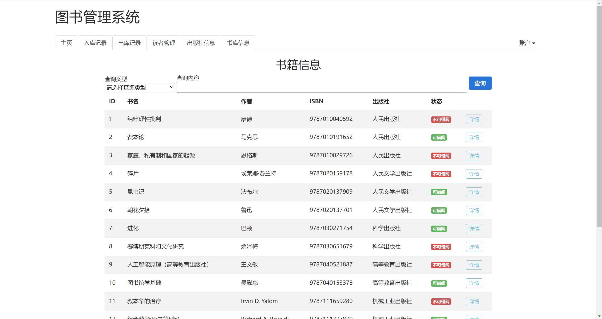
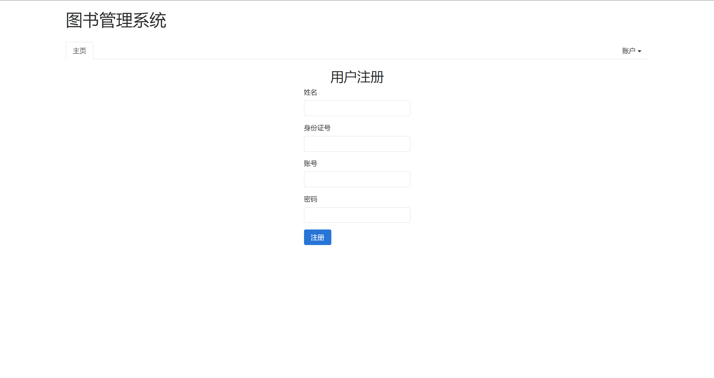
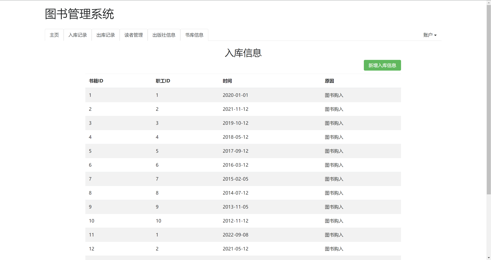
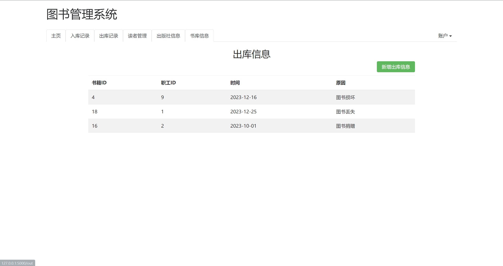
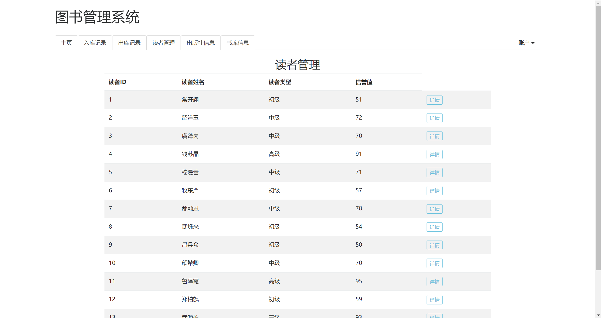

# 图书管理系统
这是一个使用Flask实现的简单的图书管理系统，Flask是一个轻量级的Python Web应用框架。
    <div style="display: flex; justify-content: center;">
        
    </div>
## 需求
- flask（网站）
- flask-login（用户登录）
- flask-sqlalchemy（数据库交互）
- python-dotenv（环境变量配置）
- colorama（命令行着色，flask依赖）

## 文件结构
```
.
├── library_management  # 应用包
│   ├── static          # 静态文件
│   ├── templates       # 模板文件
│   ├── __init__.py     # 应用实例
│   ├── commands.py     # 自定义命令
│   ├── models.py       # 模型
│   └── views.py        # 视图
├── wsgi.py             # 环境变量加载器
├── .flaskenv           # Flask环境变量
```
## 功能
- 登录
    <div style="display: flex; justify-content: center;">
        
    </div>
- 修改/查看个人信息
    <div style="display: flex; justify-content: center;">
        
    </div>
- 书库查询
    <div style="display: flex; justify-content: center;">
        
    </div>
- 书库查询
    <div style="display: flex; justify-content: center;">
        
    </div>
- 出版社查询
    <div style="display: flex; justify-content: center;">
        
    </div>
- 读者
  - 注册
        <div style="display: flex; justify-content: center;">
            
        </div>
  - 借书
    <div style="display: flex; justify-content: center;">
        
    </div>
  - 还书
    <div style="display: flex; justify-content: center;">
        
    </div>
- 职工
  - 图书信息修改
        <div style="display: flex; justify-content: center;">
            
        </div>
  - 图书入库
        <div style="display: flex; justify-content: center;">
            
            
        </div>
  - 图书出库
        <div style="display: flex; justify-content: center;">
            
            
        </div>
  - 读者管理
        <div style="display: flex; justify-content: center;">
            
        </div>
- 管理员
  - 职工管理
        <div style="display: flex; justify-content: center;">
            
        </div>
  - 新建职工
        <div style="display: flex; justify-content: center;">
            
        </div>
## 安装
- 克隆仓库
- 安装依赖
- 初始化数据库
    ```shell
    flask initdb --drop
    ```
    若修改了数据库关系模式，则需要重新初始化数据库
- 创建测试数据
    ```shell
    flask forge
    ```
    导入测试数据，以便测试应用
- 创建管理员账户
    ```shell
    flask admin
    ```
    创建管理员账户，以便登录管理网站
- 运行应用
    ```shell
    flask run
    ```
    运行网站，访问`http://127.0.0.1:5000/`，其余路由参见views.py文件

# Library-Management
This is a simple Book Management System implemented using Flask, a lightweight web application framework for Python.

## Requirements
- flask
- flask-login
- flask-sqlalchemy
- python-dotenv
- colorama

## File Structure
```
.
├── library_management  # Application package
│   ├── static          # Static files
│   ├── templates       # Templates
|   |   ├── base.html   # Base template
|   |   ├── index.html  # Index template
|   |   ├── login.html  # login template
│   ├── __init__.py     # Application factory
│   ├── commands.py     # Custom commands
│   ├── models.py       # Models
│   └── views.py        # Views
├── wsgi.py             # Environment variables loader
├── .flaskenv           # Flask Environment variables
```

## Installation
- Clone the repository
- Install the requirements
- Initialize the database
    ```shell
    flask initdb --drop
    ```
- Create fake data to test the application
    ```shell
    flask forge
    ```
- Create an administrator account
    ```shell
    flask admin
    ```
- Run the application
    ```shell
    flask run
    ```


