> 组员：21307069 张雄，21307088 郑圳毅，21311156 刘思迪

# 需求建模

## 系统功能性需求

​	本网站的基本目标是提供一个存储图书馆的书籍用户信息的平台，记录图书基本信息以及借阅情况，同时满足图书馆职员的管理需求和读者的查询借阅需求，方便更好的管理图书馆和在图书馆借阅书籍。

​	网站主要的三类实体为读者、图书馆职员（管理员）和书籍，其中读者和职员为用户，书籍只需要储存信息。对于这三类角色，他们所需的主要功能如下：

- **图书馆职员**：记录书籍的入库和出库信息，管理图书馆库藏，增加/删减图书资源，管理读者的借阅权限；
- **读者**：查询图书信息，借出和归还书籍；
- **书籍**：记录书籍的基本信息、借阅情况以及在馆内所处的位置。

​	对于职员和读者这两种用户，用户组织架构图如下所示：


## 系统用例

​	根据上述用户的基本功能性需求，以下列出可能的系统需求用例：

**读者：**

- 查询书籍信息
- 借出书籍
- 归还书籍
- 查询借阅记录
- 申请提升权限

**职员：**

- 管理读者权限
  - 提升读者权限
  - 降低读者权限
- 新增书籍入库
- 已有书籍出库
- 修改书籍信息
- 管理出版商信息
  - 增加出版商
  - 删除出版商

## 系统核心用例

### 读者借出书籍

**主要参与者：** 读者

**涉众及关注点：**

1. 读者：希望能够快速完成借阅过程，
2. 职员：希望书籍已借出、归还时间等信息被准确录入

**前置条件：**系统中已经添加了读者的账号

**主成功场景：**

- 读者使用账号密码登录网站（在终端使用读者证录入信息）
- 读者选择批量或单独借出书籍
- 读者录入书籍信息
- 读者成功借出书籍，系统更新数据库信息

**扩展失败场景：**

- 读者的账号不存在或密码错误
- 书籍信息录入错误
- 读者的可借书籍数量不足
- 书籍状态为不可借阅

**发生频率：** 经常发生

**特殊需求：** 无

### 职员提升读者权限

**主要参与者：** 职员

**涉众及关注点：**

1. 职员：希望精确快速的修改读者权限，满足读者的请求
2. 读者：希望被更快提升权限

**前置条件：** 读者提交升级申请

**主成功场景：**

- 职工通过账号密码登录网站
- 职工例行检视提交申请的读者表格
- 职工查看具体读者信息
- 职工提升符合条件的读者等级

**扩展失败场景：** 无

**发生频率：** 较少发生

**特殊需求：** 无

### 读者查询书籍信息

**主要参与者：** 读者

**涉众及关注点：**

1. 读者：希望能够快速准确获取书籍信息

**前置条件：**系统中已经添加了读者的账号

**主成功场景：**

- 读者使用账号密码登录网站（在终端使用读者证录入信息）
- 读者输入需要查询的书籍名/作者等信息
- 系统给出符合条件的书籍列表，包括书籍的详细信息和是否在馆等状态信息
- 读者完成查询，自行选择继续查询或退出系统

**扩展失败场景：**

- 读者的账号不存在或密码错误
- 没有与输入信息相匹配的书籍信息

**发生频率：**经常发生

**特殊需求：**无

## 领域模型

​	在这个系统中共具有6个角色，分别为读者、职员、书籍、读者类型（等级）、图书馆区域（书库）和出版社，他们之间存在如下关系：

- 一个职员可以管理多个读者、书籍和出版社的信息，即职员和读者、书籍和出版社之间都是一对多关系
- 一个读者可以借阅多本书籍，读者和书籍之间也是一对多关系
- 每个读者类型都可能有多个读者，而每个读者只可能处于一种类型中，读者类型和读者之间是一对多关系
- 图书馆每个区域会有若干本书籍，图书馆区域和书籍是一对多关系
- 每个出版社可以出版多本图书，出版社和书籍之间是一对多关系

据此，画出系统的领域模型：

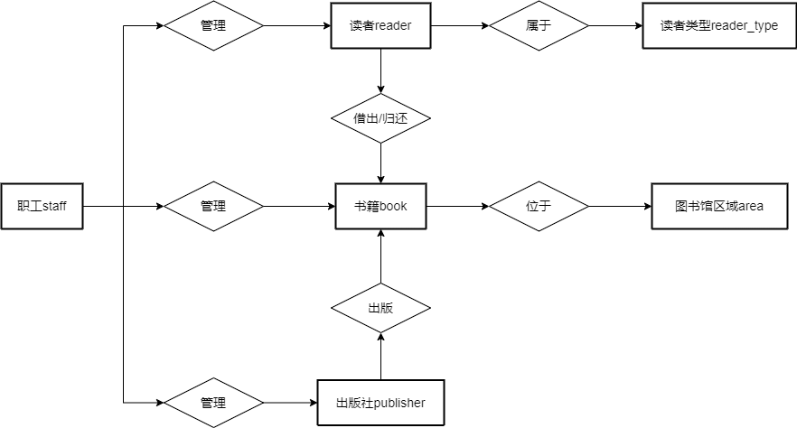


# 架构设计

## 系统架构及原理

本系统采用MVC的设计模式，为了更加清晰地显示其架构图，将model层再细分为两层：Domain层和Foundation层。Domain层主要表示系统的数据模型，Foundation层主要表示系统所使用的数据库类型支持和框架支持。下面是本系统的架构图：

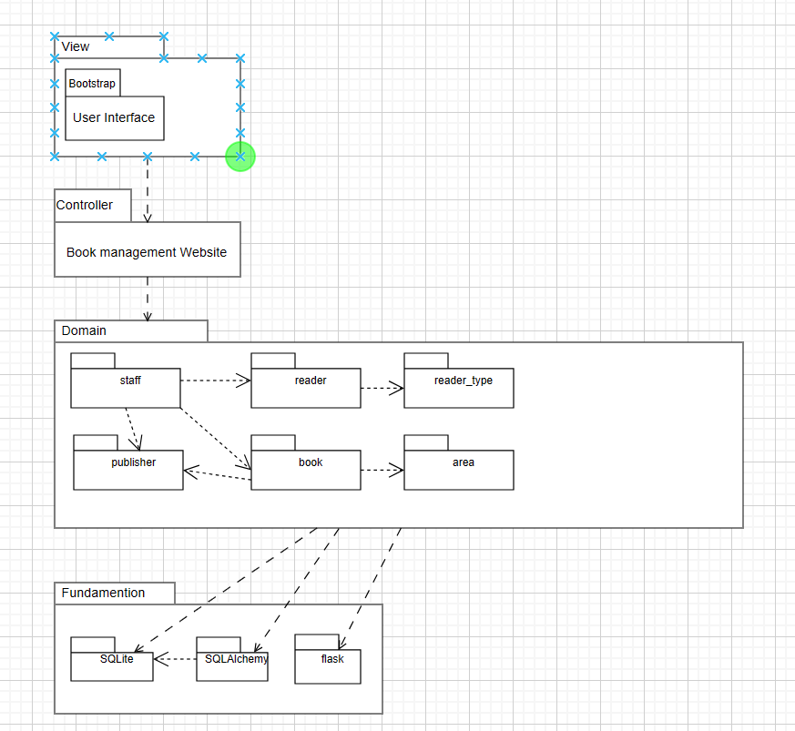

视图层，即View层，是最顶层。负责界面的显示，以及与用户的交互功能，例如表单、网页等，是用户直接接触的一层，为用户提供了简约美观的界面，使用户能够更加方便地使用系统。

控制层，即Controller层，是中间层。负责接收用户的请求，调用模型层处理用户的请求，然后将处理结果返回给用户。可以理解为一个分发器，用来决定对于视图发来的请求，需要用哪一个模型来处理，以及处理完后需要跳回到哪一个视图。即用来连接视图和模型。

领域层，即Domain层，是第三层。存放系统的各个模型数据，

基础层，即Foundation层，是最底层。存放系统所使用的数据库类型支持和框架支持，例如数据库连接、数据库操作等。

## 业务用例的实现

下面我们将介绍本系统涉及的重要业务用例，分别是：读者注册、图书借阅、图书入库、读者管理。

### 读者注册
读者注册是读者用户使用本系统的第一步，也是最重要的一步。读者注册的主要参与者是读者，与系统的交互过程如下：
1. 读者进入注册界面，输入姓名、身份证号、要注册的账号和账号密码等必要信息。
2. 系统检查读者输入的信息是否符合要求，如果不符合要求，则提示读者重新输入。如果符合要求，则系统在数据库中添加读者信息。
3. 读者注册成功，可以使用注册的账号密码登录系统，网页跳转到登录界面。
4. 读者使用注册的账号密码登录系统，进入读者主界面。
5. 读者进入个人信息界面，查看并完善修改个人信息。

### 图书借阅
图书借阅是读者使用本系统的主要功能，也是本系统的核心功能。图书借阅的主要参与者是读者，与系统的交互过程如下：
1. 读者在登录界面选择登录类型为读者，输入账号密码登录系统。
2. 系统验证学生的账号和密码。
3. 读者成功登录系统，进入读者主界面。
4. 读者选择书籍查找类型，如按作者、书名、ISBN等方式查找，输入书籍信息。
5. 系统根据读者输入的信息，从数据库中查找符合条件的书籍信息，返回给读者。
6. 读者选择要借阅的书籍，点击借阅按钮。
7. 系统检查书籍是否处于可借阅状态，如果不是，则提示读者该书籍不可借阅。
8. 系统检查读者是否还可以借阅书籍，如果不可以，则提示读者已达到借阅上限。
9. 读者借阅成功，系统将书籍状态改为不可借阅，将借阅信息添加到数据库中。
### 图书入库
图书入库是职工使用本系统的主要功能，也是本系统的核心功能。图书入库的主要参与者是职工，与系统的交互过程如下：
1. 职工在登录界面选择登录类型为职工，输入账号密码登录系统。
2. 系统验证职工的账号和密码。
3. 职工成功登录系统，进入职工主界面。
4. 职工进入图书入库界面，输入书籍信息。
5. 系统查询数据库检查书籍号是否已被使用，如果已被使用，则提示职工重新输入。
6. 系统查询数据库检查出版社是否存在，如果不存在，则提示职工重新输入或者添加新的出版社。
7. 系统查询数据库检查书库是否存在，如果不存在，则提示职工重新输入或者添加新的书库。
8. 系统将书籍信息添加到数据库中。
9. 系统添加入库信息到数据库中。
10. 职工入库成功，返回入库主界面。
### 读者管理
读者管理是职工的重要功能，职工应该定期查看读者信誉值，修改满足条件的读者的读者类型。读者管理的主要参与者是职工，与系统的交互过程如下：
1. 职工在登录界面选择登录类型为职工，输入账号密码登录系统。
2. 系统验证职工的账号和密码。
3. 职工成功登录系统，进入职工主界面。
4. 职工进入读者管理界面，检查读者信誉值和读者类型。
5. 选择满足条件的读者，修改读者类型。
6. 系统接收到职工的修改请求，修改读者类型。
7. 职工修改成功.
## 数据库设计

### ER图

本系统的ER图如下所示：

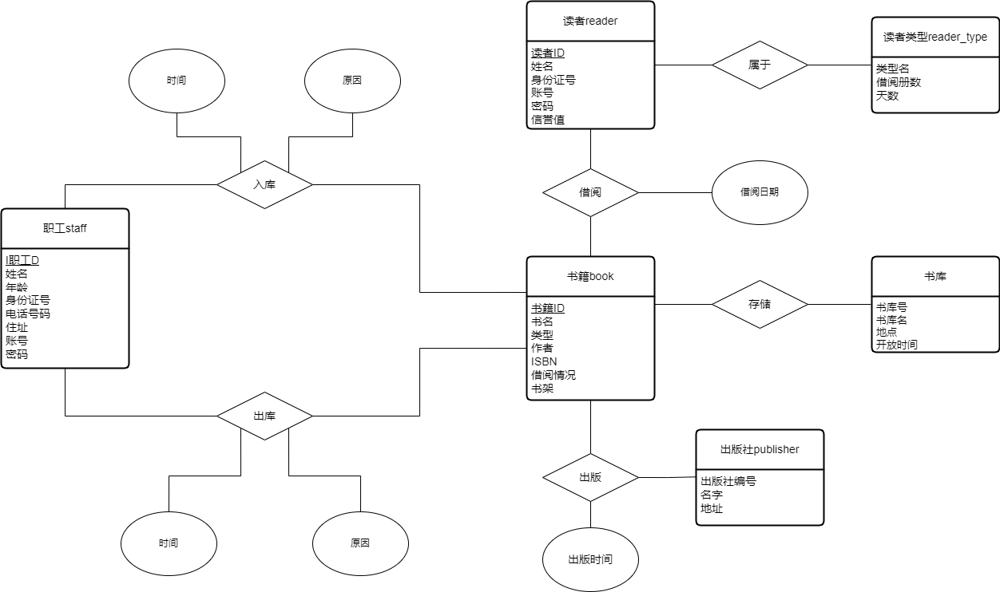

### 数据库关系模式

本系统共有9张数据库表，分别是staff、book_out、book_entering、book、publisher、stack、borrow、reader、reader_type。下面分别对这些表进行介绍。

|     表名      |                说明                |
| :-----------: | :--------------------------------: |
|     staff     |     员工表，用于存储员工的信息     |
|   book_out    |   出库表，用于存储图书出库的信息   |
| book_entering |   入库表，用于存储图书入库的信息   |
|     book      |     图书表，用于存储图书的信息     |
|   publisher   |   出版社表，用于存储出版社的信息   |
|     stack     |     书库表，用于存储书库的信息     |
|    borrow     |     借阅表，用于存储借阅的信息     |
|    reader     |     读者表，用于存储读者的信息     |
|  reader_type  | 读者类型表，用于存储读者类型的信息 |


下面对这些表的字段进行介绍。

<center>职工表</center>

|     字段     |   数据类型   | 主键/外键 |     说明     |
| :----------: | :----------: | :-------: | :----------: |
|   staff_id   |     int      |   主键    |   职工编号   |
|     name     | varchar(40)  |           |   职工姓名   |
|     age      |     int      |           |   职工年龄   |
|   id_card    | varchar(18)  |           | 职工身份证号 |
| phone_number | varchar(11)  |           | 职工电话号码 |
|   address    | varchar(80)  |           |   职工住址   |
|   account    |  varchar(8)  |           |   职工账号   |
|   password   | varchar(128) |           |   职工密码   |

<center>图书出库表</center>

|   字段   |  数据类型   | 主键/外键 |     说明     |
| :------: | :---------: | :-------: | :----------: |
| book_id  |     int     |   主键    | 出库图书编号 |
| staff_id |     int     |   主键    | 经手职工编号 |
|   date   |    date     |           |   出库日期   |
|  reason  | varchar(20) |           |   出库原因   |

<center>图书入库表</center>

|   字段   |  数据类型   | 主键/外键 |           说明           |
| :------: | :---------: | :-------: | :----------------------: |
| book_id  |     int     |   主键    |       入库图书编号       |
| staff_id |     int     |   主键    |       经手职工编号       |
|   date   |    date     |           |         入库日期         |
|  reason  | varchar(20) |           | 入库原因，也就是书籍来源 |

<center>图书表</center>

|     字段     |  数据类型   | 主键/外键 |                  说明                  |
| :----------: | :---------: | :-------: | :------------------------------------: |
|   book_id    |     int     |   主键    |                图书编号                |
|   stack_id   |     int     |   外键    |            图书所处书库编号            |
| publisherid  |     int     |   外键    |             图书出版社编号             |
|    title     | varchar(40) |           |                图书名称                |
|     type     | varchar(25) |           |                图书类型                |
|    author    | varchar(40) |           |                图书作者                |
| availability |   Boolean   |           |             图书是否被收录             |
|     ISBN     | varchar(13) |           |                图书ISBN                |
|    place     | varchar(40) |           |              图书存放位置              |
|    state     |   Byte(1)   |           | 图书状态，有在馆、借出和流通中三个状态 |

<center>出版社表</center>

|    字段     |  数据类型   | 主键/外键 |    说明    |
| :---------: | :---------: | :-------: | :--------: |
| publisherid |     int     |   主键    | 出版社编号 |
|    name     | varchar(40) |           | 出版社名称 |
|   address   | varchar(80) |           | 出版社地址 |

<center>书库表</center>

|    字段    |  数据类型   | 主键/外键 |     说明     |
| :--------: | :---------: | :-------: | :----------: |
|  stack_id  |     int     |   主键    |   书库编号   |
| stack_name | varchar(25) |           |   书库名称   |
|  location  | varchar(80) |           |   书库位置   |
|  opening   | varchar(40) |           | 书库开放时间 |

<center>借阅表</center>

|   字段    | 数据类型 | 主键/外键 |      说明      |
| :-------: | :------: | :-------: | :------------: |
|  book_id  |   int    |   主键    | 被借阅图书编号 |
| reader_id |   int    |   主键    |  借阅读者编号  |
|   date    |   date   |           |    借阅日期    |
| is_return |   bool   |           |    是否归还    |

<center>读者表</center>

|   字段    |   数据类型   | 主键/外键 |     说明     |
| :-------: | :----------: | :-------: | :----------: |
| reader_id |     int      |   主键    |   读者编号   |
| type_name | varchar(10)  |   外键    |   读者类型   |
|   name    | varchar(40)  |           |   读者姓名   |
|  id_card  | varchar(18)  |           | 读者身份证号 |
|  account  |  varchar(8)  |           |   读者账号   |
| password  | varchar(128) |           |   读者密码   |
|  credit   |     int      |           |  读者信誉值  |

<center>读者类型表</center>

|      字段       |  数据类型   | 主键/外键 |       说明       |
| :-------------: | :---------: | :-------: | :--------------: |
|    type_name    | varchar(10) |   主键    |   读者类型名称   |
| avaibook_number |     int     |           | 同时可借图书数量 |
|      days       |     int     |           |   最长借阅天数   |


# 模块设计

本系统按照用户群体划分三个模块：管理员模块、职工模块和读者模块。管理员模块主要负责对职工的管理，包括职工账号的添加和删除；职工模块主要负责对图书的和读者的管理，包括图书的入库和出库、图书的添加和删除、读者类型的修改、书库开放时间管理、出版社信息管理、职工个人信息修改；读者模块主要负责对图书的借阅和归还、对个人信息的修改。本章选取职工模块的图书管理和读者模块的图书借阅和图书归还作为本系统的三个功能模块进行详细介绍，管理员模块功能比较简单，不再赘述。

## 图书入库

图书入库是职工的功能，即添加一本新的图书到图书馆的馆藏中。职工选择添加入库之后，跳转到图书入库页面，填写要添加的图书的信息后，点击添加按钮。系统会检查图书的信息是否正确，比如书库、出版社是否存在，书籍号是否已经被使用，如果信息正确，系统会将图书信息添加到数据库中，否则会提示职工重新填写信息。图书入库的流程图如下所示：

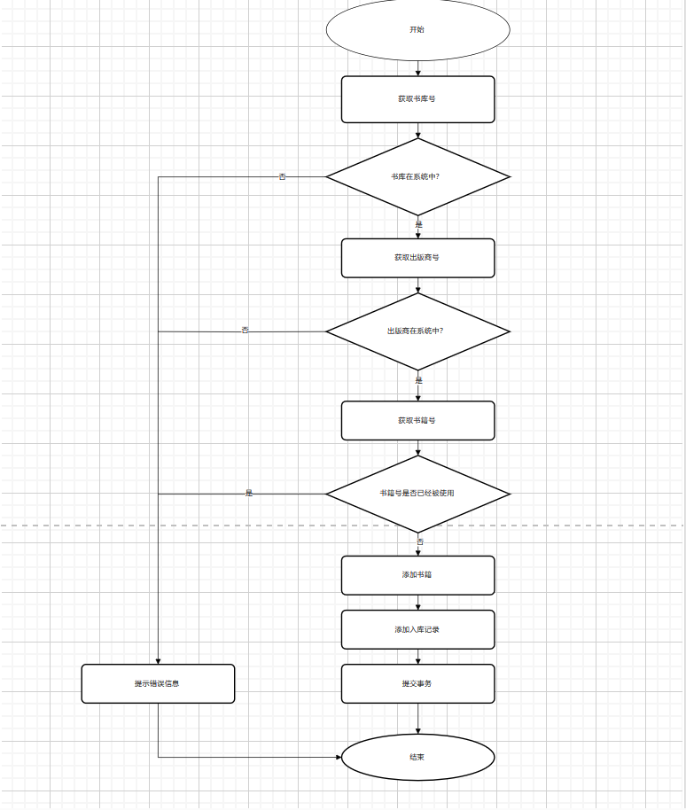

下面是图书入库的核心代码.当职工选择添加书籍入库之后，系统会检查书籍的信息是否正确，如果正确则将书籍信息和入库记录添加到数据库中，否则提示职工重新填写信息。
```python
def add_entering(
    title,
    book_id,
    ISBN,
    type_name,
    author,
    publisher_id,
    stack_id,
    place,
    reason,
    staff_id,
) -> bool:
    """
    添加入库书籍,返回是否添加成功
    book的外键publisher_id和stack_id需要先查询出对应的id，如果没有则需要先添加
    如果book_id已存在则返回False
    """
    if Publisher.query.filter(Publisher.publisher_id == publisher_id).first() == None:
        return False
    if Stack.query.filter(Stack.stack_id == stack_id).first() == None:
        return False
    if Book.query.filter(Book.book_id == book_id).first() != None:
        return False
    book = Book(
        book_id=book_id,
        ISBN=ISBN,
        type=type_name,
        title=title,
        author=author,
        publisher_id=publisher_id,
        availability=True,
        state=True,
        place=place,
        stack_id=stack_id,
    )
    entering = BookEntering(
        book_id=book_id, staff_id=staff_id, reason=reason, date=datetime.date.today()
    )
    db.session.add(book)
    db.session.add(entering)
    db.session.commit()
    return True
```

## 图书借阅
图书借阅是读者用户的功能，读者首先找到想要借阅的书籍，然后系统对读者状态和书籍状态进行判断，符合条件之后，系统在借阅表中添加一条借阅记录，然后将书籍的状态改为不可借阅。，读者成功借阅图书。图书借阅的流程图如下所示：

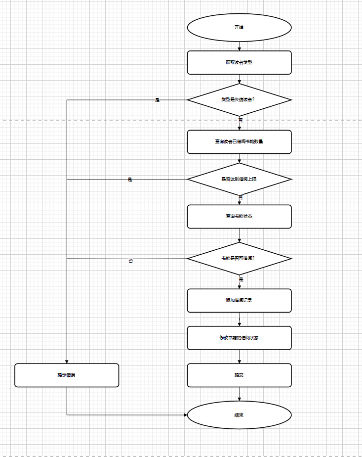

下面是图书借阅的核心代码。系统先会检查读者的信誉值，信誉值过低的读者将失去借书资格；然后根据读者类型查询该读者最大的借阅数量和已借阅书籍数量，如果该读者已经借阅的书籍数量超过了最大借阅数量，则不能借阅；然后系统检查读者想要借阅的书籍是否处于可借阅的状态。如果书籍可以借阅，则系统在借阅表中添加一条借阅记录，然后将书籍的状态改为不可借阅，读者成功借阅图书。
```python
def borrow_book(book_id, reader_id) -> bool:
    """
    读者借书,返回是否借书成功
    """
    # todo：讨论具体信誉值
    # 检验读者是否有借书资格
    reader = Reader.query.filter(Reader.reader_id == reader_id).first()
    reader_type = ReaderType.query.filter(
        ReaderType.type_name == reader.type_name
    ).first()
    if reader.credit < 60: # 信誉值小于60则不能借书
        return False

    # 检验读者是否超过借书数量限制
    borrow_count = Borrow.query.filter(
        and_(Borrow.reader_id == reader_id, Borrow.is_return == False)
    ).count()
    if borrow_count >= reader_type.available_number:
        print("借书数量超过限制")
        return False

    # 检验书籍是否可借
    book = Book.query.filter(Book.book_id == book_id).first()
    if book.state == False:  # 书籍已被借阅
        print("书籍已被借阅")
        return False

    # 修改书籍和借阅记录并提交
    book.state = False
    new_id = Borrow.query.order_by(Borrow.borrow_id.desc()).first().borrow_id + 1
    if not new_id:
        new_id = 1
    borrow = Borrow(
        borrow_id=new_id,
        book_id=book_id,
        reader_id=reader_id,
        date=datetime.date.today(),
        is_return=False,
    )
    db.session.add(book)
    db.session.add(borrow)
    db.session.commit()
    return True
```
## 图书归还

图书借阅同样是读者用户的功能，读者首先浏览自己的已状态为未归还的借阅记录，对于其中符合条件的记录，读者可以选择归还，同时系统将这条记录状态改为已归还，并将书籍的状态改为可借阅，这样就成功完成了图书的归还。图书归还的流程图如下所示：

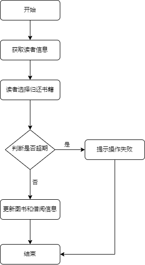

具体实现代码方法如下。首先，获取对应读者的借阅信息：

```python
def books_to_return(reader_id):
    """
    读者借阅的书籍,返回书籍列表(书籍ID、书名、借阅时间、剩余时间)
    [{book_id, title, date, day_left}]
    """
    # 获取读者类型和每次借阅期限
    reader_type = Reader.query.filter(Reader.reader_id == reader_id).first().type_name
    available_number = (
        ReaderType.query.filter(ReaderType.type_name == reader_type)
        .first()
        .available_number
    )
    
    # 查询该读者的未归还的借阅记录
    books = (
        db.session.query(
            Borrow.book_id.label("book_id"),
            Borrow.date.label("date"),
            (Borrow.date + available_number - datetime.date.today()).label("day_left"),
        )
        .join(Book)
        .add_column(Book.title.label("title"))
        .filter(Borrow.reader_id == reader_id, Borrow.is_return == False)
    )
    return books
```

然后，根据已有记录，读者可以选择归还该图书。若没有逾期则可以顺利归还，若逾期，则操作失败，需要找图书管理员进行人工手续：

```python
def return_book_by_id(book_id) -> bool:
    """
    读者还书,返回是否还书成功
    """
    # 查找书籍和借阅记录
    book = Book.query.filter(Book.book_id == book_id).first()
    borrow = (
        Borrow.query.filter(Borrow.book_id == book_id)
        .order_by(Borrow.borrow_id.desc())
        .first()
    )

    # 检验是否超期
    reader = Reader.query.filter(Reader.reader_id == borrow.reader_id).first()
    reader_type = db.session.query(ReaderType).filter(
        ReaderType.type_name == reader.type_name
    ).first()
    if (datetime.date.today() - borrow.date).days > reader_type.days:
        # 超期
        return False

    # 修改书籍和借阅记录并提交
    book.state = True
    borrow.is_return = True
    db.session.add(book)
    db.session.add(borrow)
    db.session.commit()
    return True
```


# 部署与应用

## 系统部署架构
该图书管理系统采用了B/S架构，即浏览器/服务器架构，用户通过浏览器访问服务器，服务器处理用户的请求并返回结果给用户。本系统基于Flask框架，通过SQLAlchemy进行数据库操作，使用Bootstrap框架进行前端页面设计，使用Jinja2模板引擎进行页面渲染。
## 环境配置
图书管理系统主要依赖库如下：
- flask（网站框架）
- flask-login（用户登录）
- flask-sqlalchemy（数据库交互）
- python-dotenv（环境变量配置）

本系统依赖于Python(>=3.7)，安装Python后，通过pip指令安装依赖。
```shell
pip install -r requirements.txt
```
## 运行
以下操作均在项目根目录下进行。
- 环境变量
    创建`.env`文件，配置环境变量。`SECRET_KEY`为密钥，需要通过随机生成字符串`uuid.uuid4().hex`进行修改，如下所示：
    ```
    SECRET_KEY=dev              # Flask的密钥
    DATABASE_FILE=library.db    # 数据库文件名
    ```
    若需要将项目于生产环境运行，需要将`.flaskenv`文件进行修改
    ```
    FLASK_APP=library_management
    FLASK_ENV=production
    FLASK_DEBUG=0
    ```
- 数据库初始化
    ```shell
    flask init --drop
    ```
    初始化数据库，`-drop`参数表示删除原有数据库，重新创建。
- 初始数据
    ```shell
    flask forge
    ```
    导入初始数据用于测试。
- 管理员注册
    ```shell
    flask admin
    ```
    输入管理员账号密码，即可注册管理员账号。
- 运行
    ```shell
    flask run
    ```
    运行网站，通过访问端口5000即可访问网站，本地可以通过`http://127.0.0.1:5000`访问。
## 部分功能截图
- 登录
    在登录界面，可以选择登录的用户类型，包括读者、职工和管理员。
    <div style="display: flex; justify-content: center;">
        
    </div>
    
- 修改/查看个人信息
    用户可以该该界面修改个人信息并申请保存，若修改有效，则会提示修改成功。
    <div style="display: flex; justify-content: center;">
        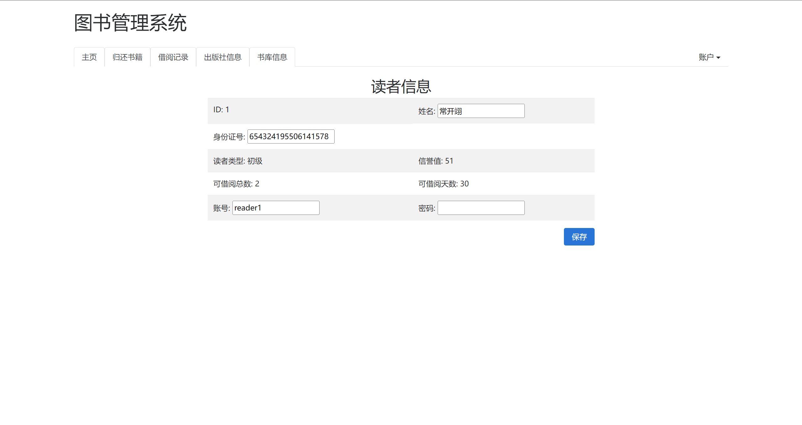
    </div>
    
- 图书查询
    图书查询作为图书管理系统的主页，可以通过ID、书名、作者、ISBN等信息查询书籍，并且可以根据每个条目后的按钮查看书籍的详细信息。
    <div style="display: flex; justify-content: center;">
        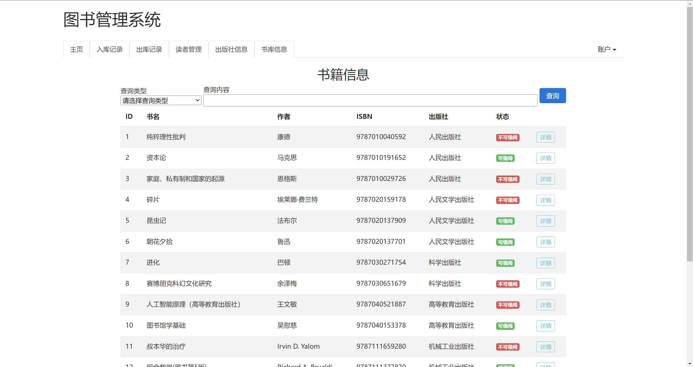
    </div>
    
- 书库查询
    书库查询可以查看所有书库的相关信息，其中职工可以新增书库。
    <div style="display: flex; justify-content: center;">
        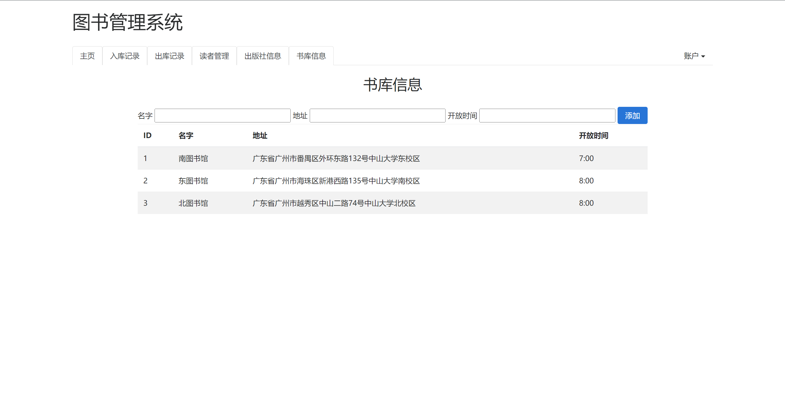
    </div>
    
- 出版社查询
    出版社查询可以查看所有出版社的相关信息，其中职工可以新增出版社。
    <div style="display: flex; justify-content: center;">
        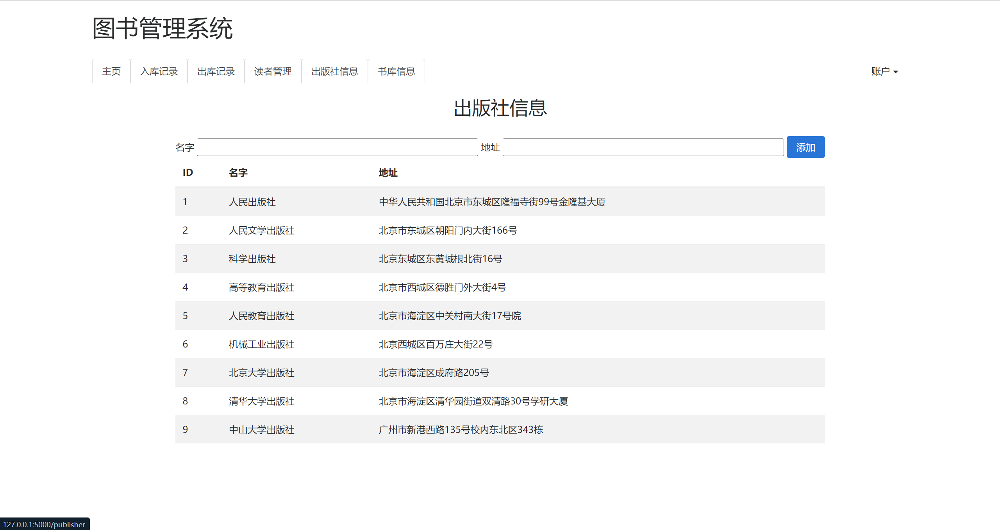
    </div>
    
- 读者
  - 注册
        读者可以通过该界面注册账号，注册成功后会跳转到登录界面。 
        <div style="display: flex; justify-content: center;">
            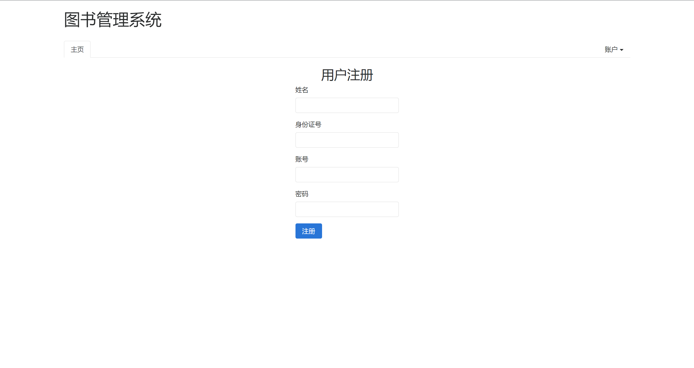
        </div>
    
  - 借书
        在图书的详情界面，读者可以进行借书，若图书可以结果，则会提供借阅图书的按钮，点击后会根据读者的信息判断是否可以借阅，若可以借阅，则会提示借阅成功，否则会提示借阅失败。
    <div style="display: flex; justify-content: center;">
     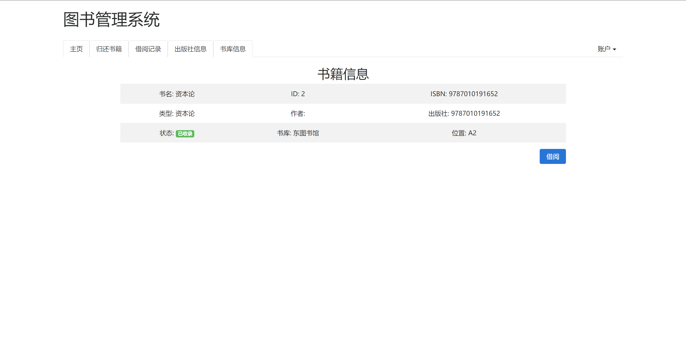
    </div>
    
  - 还书
        读者可以在归还书籍界面查看正在借阅的书籍及相关信息，并且可以进行归还书籍。 
        <div style="display: flex; justify-content: center;">
            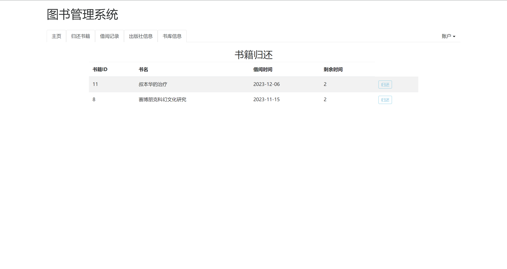
        </div>
  
- 职工
  - 图书信息修改
        在图书的详情界面，职工可以查看该书籍的历史借阅记录、入库记录以及出库记录，并且可以修改图书的信息。 
        <div style="display: flex; justify-content: center;">
            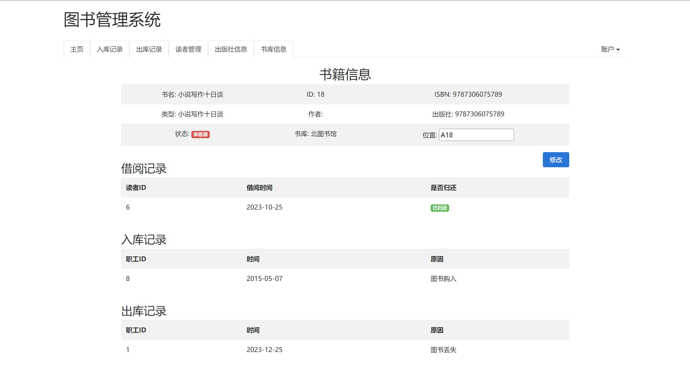
        </div>
  - 图书入库
        职工可以查看所有入库记录，并且可以新增入库记录。 
        <div style="display: flex; justify-content: center;"> 
    ​        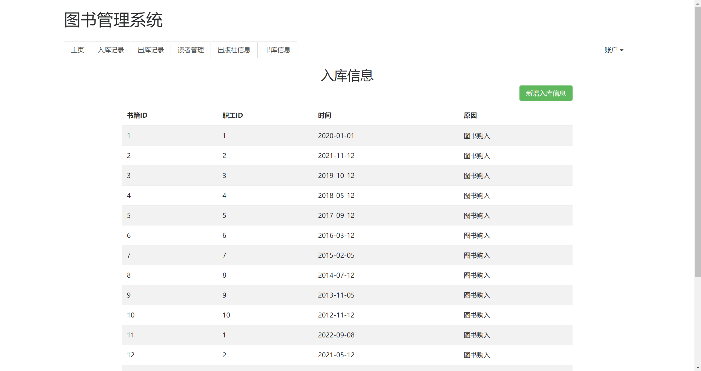
    ​        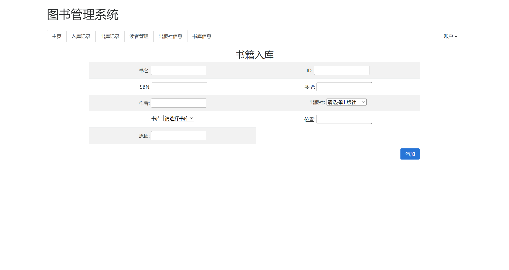
    ​    </div>
  - 图书出库
        职工可以查看所有出库记录，并且可以新增出库记录。
        <div style="display: flex; justify-content: center;">
            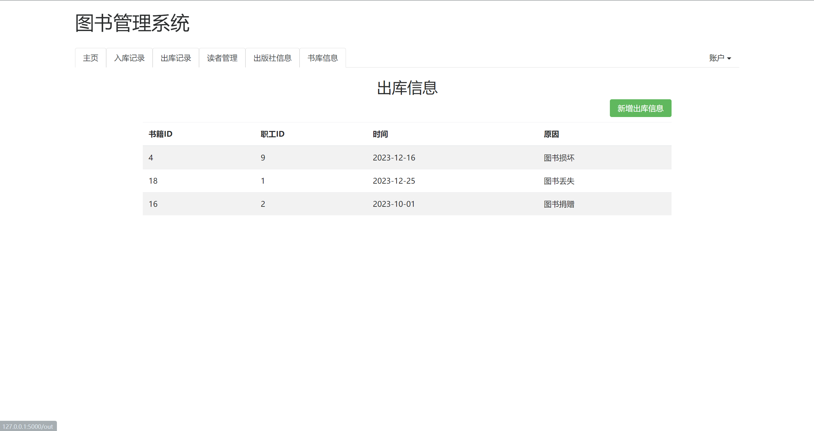
            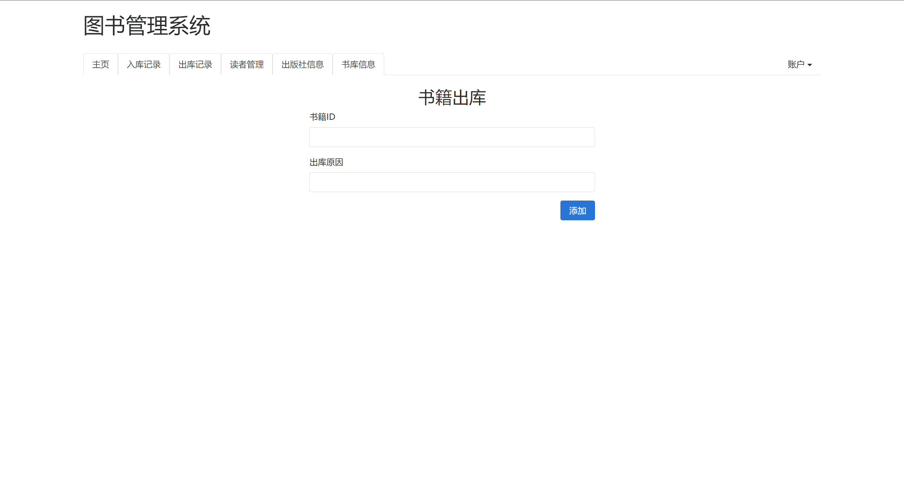
        </div>
  - 读者管理
        职工可以查看所有读者，并通过详情按钮查看读者的详细信息，并允许对读者类型进行修改。
        <div style="display: flex; justify-content: center;">
            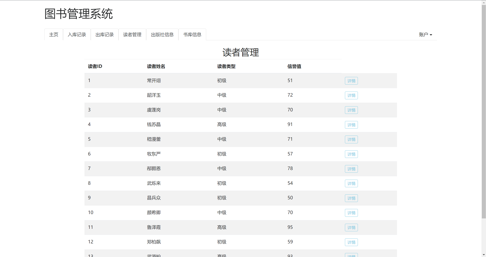
        </div>
  
- 管理员
  - 职工管理
        管理员的主页显示所有职工的信息。
        <div style="display: flex; justify-content: center;">
            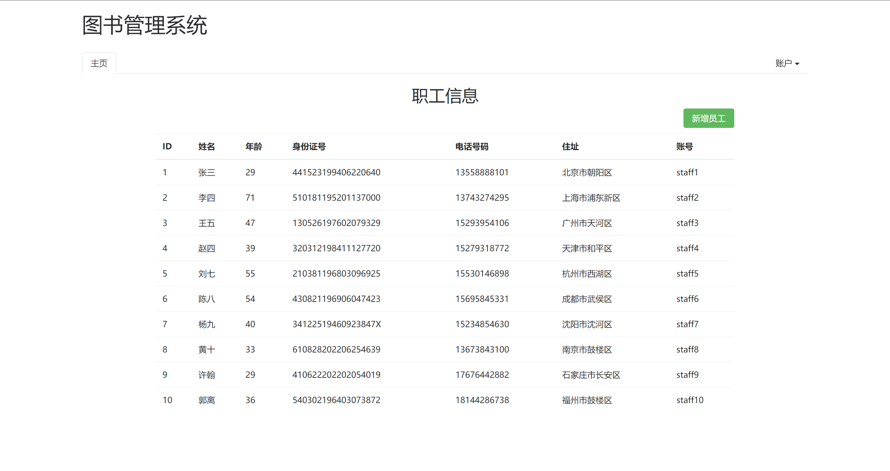
        </div>
  - 新建职工
        管理员可以新建职工账号。 
        <div style="display: flex; justify-content: center;">
            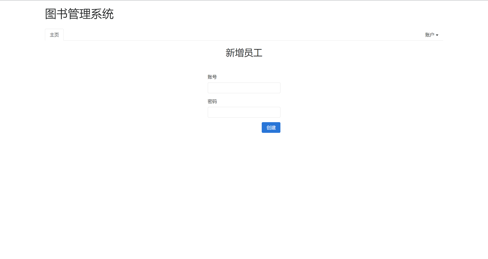
        </div>
